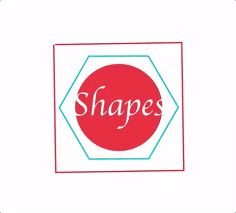

# Shapes Animated SVG Logo

CSS keyframes are used to animate parts of the SVG logo.

Live version: https://shapes-animated-svg-logo.herokuapp.com



## Tech stack
* Node
* Express
* Heroku
* Browsersync
* CSS3 Animations
* Vanilla JavaScript
* ES6

## Getting started

```sh
git clone https://github.com/PiotrBerebecki/shapes-animated-svg-logo.git
cd shapes-animated-svg-logo
npm install

#1. Start the development server with Browsersync reloading
npm run dev

#2. Open this url in your browser: http://localhost:3000
```
